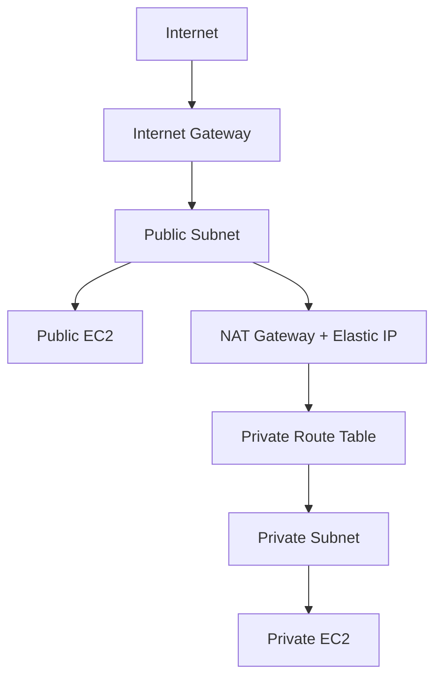

# VPC Public + Private + NAT Architecture

```mermaid
flowchart TB
    Internet --> IGW[Internet Gateway]
    IGW --> Public[Public Subnet]
    Public --> Web[Public EC2]
    Public --> NAT[NAT Gateway + Elastic IP]
    NAT --> PrivateRT[Private Route Table]
    PrivateRT --> Private[Private Subnet]
    Private --> App[Private EC2]
```

**Key idea:** the private subnet uses NAT for outbound Internet access; the NAT Gateway is placed in the public subnet.
