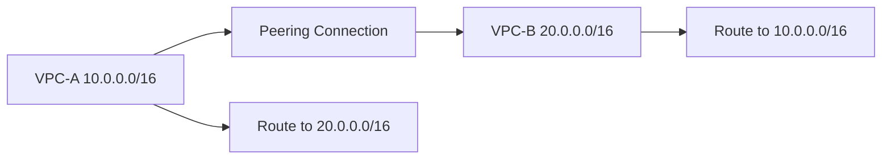

# VPC Peering Architecture

```mermaid
flowchart LR
    VA[VPC-A 10.0.0.0/16] --> PA[Peering Connection]
    PA --> VB[VPC-B 20.0.0.0/16]
    VA --> R1[Route to 20.0.0.0/16]
    VB --> R2[Route to 10.0.0.0/16]
```

**Requirements:** non-overlapping CIDRs, active peering, routes on both sides, and appropriate security rules.
