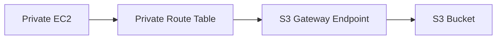

# Private EC2 -> S3 Gateway Endpoint

```mermaid
flowchart LR
    EC2[Private EC2] --> RT[Private Route Table]
    RT --> EP[S3 Gateway Endpoint]
    EP --> S3[S3 Bucket]
```

This provides private-subnet access to S3 without requiring a NAT Gateway for that S3 traffic.
