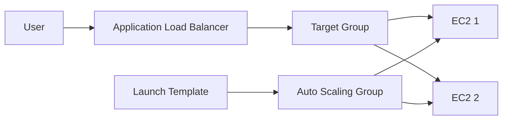

# ALB + Target Group + Auto Scaling

```mermaid
flowchart LR
    U[User] --> ALB[Application Load Balancer]
    ALB --> TG[Target Group]
    TG --> E1[EC2 1]
    TG --> E2[EC2 2]
    LT[Launch Template] --> ASG[Auto Scaling Group]
    ASG --> E1
    ASG --> E2
```

**Memory:** Launch Template = how to launch. ASG = how many to run. Target Group = backend targets.
