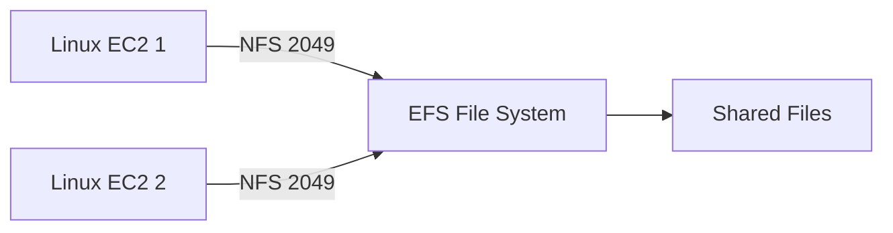

# EFS Shared Storage

```mermaid
flowchart LR
    E1[Linux EC2 1] -->|NFS 2049| EFS[EFS File System]
    E2[Linux EC2 2] -->|NFS 2049| EFS
    EFS --> D[Shared Files]
```

The lab mounts the same EFS file system on multiple Linux EC2 instances at `/shared-data`.
