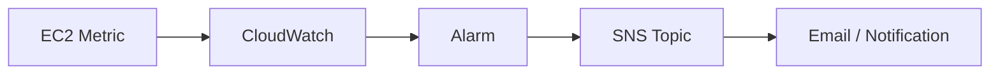

# CloudWatch + SNS

```mermaid
flowchart LR
    EC2[EC2 Metric] --> CW[CloudWatch]
    CW --> A[Alarm]
    A --> SNS[SNS Topic]
    SNS --> N[Email / Notification]
```

**Memory:** CloudWatch = monitor/detect. SNS = notify.
